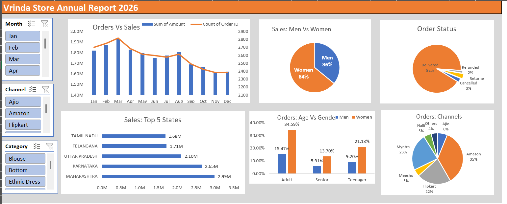

# 📊 Vrinda Store Sales Dashboard (Excel)

##  Overview

This project focuses on analyzing the Vrinda Store sales dataset using Microsoft Excel and developing an interactive dashboard to derive meaningful business insights.

It highlights how raw data can be transformed into actionable insights for better business decisions.

---

## 🎯 Objective

* Analyze sales performance
* Understand customer demographics
* Identify top-performing channels
* Build an interactive dashboard

---

## 🛠️ Tools Used

* Microsoft Excel
* Pivot Tables & Charts
* Slicers
* Excel Functions (IF, VLOOKUP, TEXT)

---

##  Process

* Cleaned and prepared raw data
* Created features like Age Group and Month
* Performed analysis using Pivot Tables
* Built an interactive dashboard using slicers

---

## 📊 Key Insights

* Women contribute approximately **65% of total sales**
* Adult age group (**30–49 years**) contributes nearly **50% of revenue**
* Top performing states: **Maharashtra, Karnataka, Uttar Pradesh**
* Leading sales channels: **Amazon, Flipkart, Myntra**

---

## 📸 Dashboard Preview

---

##  Skills Demonstrated

* Data Cleaning & Preparation
* Exploratory Data Analysis (EDA)
* Dashboard Development
* Business Insight Generation

---

## ▶️ How to Use

1. Download the Excel file
2. Open it in Microsoft Excel
3. Navigate to the Dashboard sheet
4. Use slicers to explore insights

---

## 👩‍💻 Author

Anmol Vaswani

---

##  Acknowledgment

This project is based on a guided Excel analytics workflow and was built to strengthen practical data analysis and dashboarding skills.
